# AWS Site-to-Site VPN (Hybrid Connectivity)

## Architecture Diagram


This project implements hybrid connectivity between an on-premises network (simulated in GNS3) and an AWS VPC using a Site-to-Site VPN.
Traffic flows securely from the on-prem network to AWS over encrypted IPsec tunnels, and terminates at a Virtual Private Gateway (VGW).  
The architecture includes dual tunnels for redundancy and demonstrates reliable bidirectional communication between environments.

---

## Key Design Decisions

- **Hybrid Architecture**
  - On-prem network: `192.168.0.0/24`
  - AWS VPC: `10.0.0.0/16`
  - Connectivity established using AWS Site-to-Site VPN

- **VPC Design**
  - Single public subnet (`10.0.1.0/24`) in `us-east-1a`
  - EC2 instance deployed as a test endpoint (`10.0.1.61`)

- **Virtual Private Gateway (VGW)**
  - Attached to the VPC
  - Serves as the AWS-side VPN termination point

- **Customer Gateway (CGW)**
  - Represents the on-prem VPN endpoint
  - Configured in AWS with public IP: `96.230.78.21`

- **Routing Configuration**
  - AWS route table:
    - `192.168.0.0/24 → VGW`
  - Enables private traffic to reach the on-prem network

- **High Availability**
  - Two VPN tunnels provisioned by AWS
  - Provides redundancy and automatic failover

- **Security**
  - Security group allows:
    - ICMP (ping)
    - SSH (22)
  - Enables connectivity testing and remote access

---

## Deployment Steps

### 1. AWS Infrastructure

1. Created VPC (`10.0.0.0/16`) with DNS enabled  
2. Created public subnet (`10.0.1.0/24`) in `us-east-1a`  
3. Configured route table:
   - `192.168.0.0/24 → Virtual Private Gateway`  
4. Created and attached Virtual Private Gateway (VGW)  
5. Created Customer Gateway:
   - Public IP: `96.230.78.21`
   - Routing: Static  
6. Created Site-to-Site VPN connection:
   - Linked VGW and CGW
   - Configured static route (`192.168.0.0/24`)  
7. Launched EC2 instance:
   - Private IP: `10.0.1.61`
   - Security group allows ICMP + SSH  

---

### 2. On-Prem Simulation (GNS3)

The on-prem environment is simulated using GNS3 with a Cisco IOSv router acting as the Customer Gateway.


### Router Interface Configuration

- **GigabitEthernet0/0 (WAN)**
  - IP: `192.168.1.100/24`
  - Connected to home (Verizon) router
  - Configured as: `ip nat outside`

- **GigabitEthernet0/1 (LAN)**
  - IP: `192.168.0.1/24`
  - Default gateway for on-prem network
  - Configured as: `ip nat inside`

---

### Routing Configuration

**Default route to internet:**
```
ip route 0.0.0.0 0.0.0.0 192.168.1.1
```

**Routes to AWS VPC:**
```
10.0.0.0/16 → Tunnel interfaces
```

This ensures AWS-bound traffic uses the VPN instead of the public internet.

---

### NAT Configuration

NAT is required for general internet access but must be bypassed for VPN traffic.

**NAT Exemption ACL:**
```
ip access-list extended NONAT
deny ip 192.168.0.0/24 10.0.0.0/16
permit ip 192.168.0.0/24 any
```

**NAT Overload (PAT):**
```
ip nat inside source list NONAT interface GigabitEthernet0/0 overload
```

**Behavior:**
- Traffic to AWS (`10.0.0.0/16`) is not translated (required for VPN)
- All other traffic is NATed for internet access

---

### VPN Configuration

The VPN is built using AWS Site-to-Site VPN and consists of two redundant IPsec tunnels between the on-prem Cisco IOSv router (Customer Gateway) and the AWS Virtual Private Gateway (VGW).

---

### Tunnel 1 (Primary)

- AWS Public Peer IP: `34.193.85.87`
- On-Prem Public Endpoint (NATed): `96.230.78.21`
- On-Prem WAN Interface (inside NAT): `192.168.1.100`
- Tunnel Interface: `Tunnel1`
- Inside Tunnel IPs:
  - AWS: `169.254.222.169/30`
  - On-Prem: `169.254.222.170/30`

---

### Tunnel 2 (Secondary)

- AWS Public Peer IP: `100.50.211.87`
- On-Prem Public Endpoint (NATed): `96.230.78.21`
- On-Prem WAN Interface (inside NAT): `192.168.1.100`
- Tunnel Interface: `Tunnel2`
- Inside Tunnel IPs:
  - AWS: `169.254.81.233/30`
  - On-Prem: `169.254.81.234/30`

---

## Operational Behavior

- Tunnel 1 is the primary path under normal operation.
- Tunnel 2 provides redundancy.
- If Tunnel 1 fails, traffic shifts automatically to Tunnel 2 based on routing preference and tracking.

---

### NAT Traversal (NAT-T)

Because the router is behind a home NAT device, NAT Traversal is required:

```
crypto isakmp nat keepalive 10
```

This allows IPsec to function over UDP 4500 without requiring manual port forwarding.

---

# AWS Validation

## VPC and Subnet

The base network boundary and address space for the AWS environment.

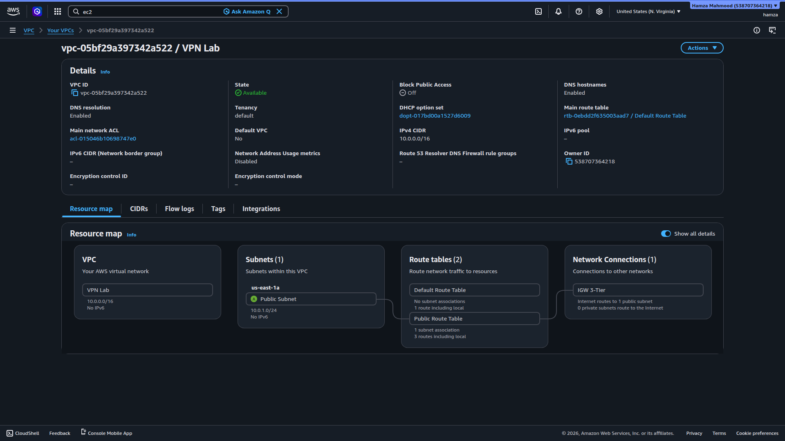
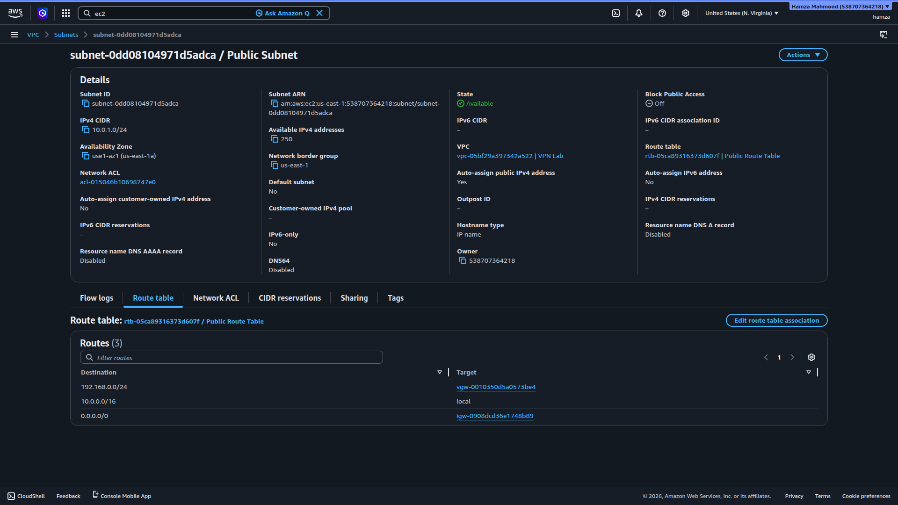

- VPC defined with `10.0.0.0/16` CIDR block
- DNS resolution and hostnames enabled for internal resolution
- Public subnet `10.0.1.0/24` deployed in `us-east-1a`
- Subnet is associated with the active route table for VPN connectivity

---

## Routing Configuration

Traffic control logic between AWS and the on-prem network.

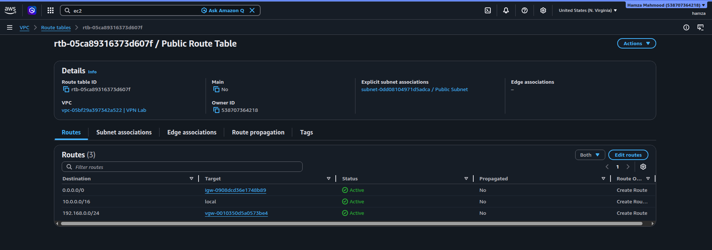
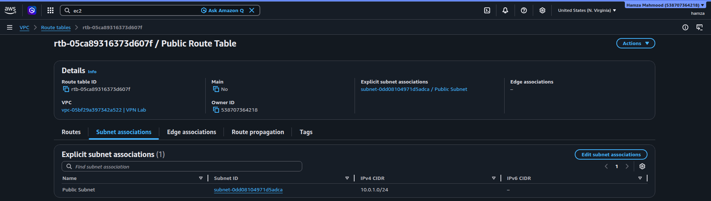

- Route to `192.168.0.0/24` directed through Virtual Private Gateway
- Local VPC route (`10.0.0.0/16`) preserved for internal traffic
- Route table explicitly attached to the application subnet

---

## VPN Configuration

Site-to-Site IPsec VPN establishing encrypted connectivity between AWS and on-prem.

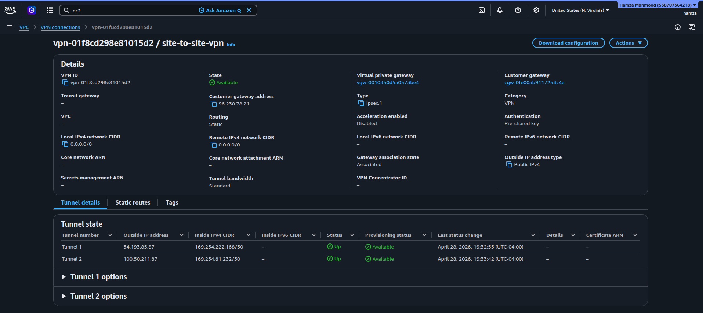
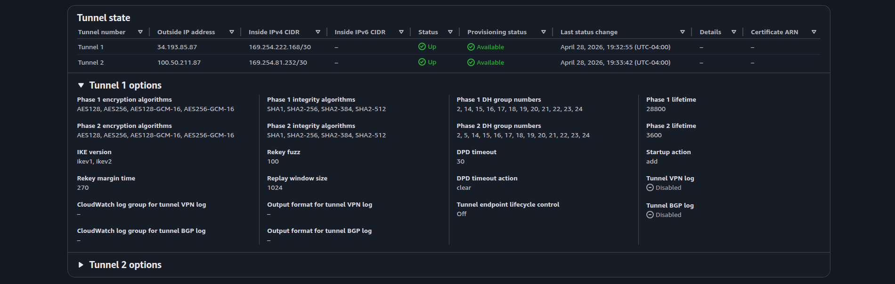
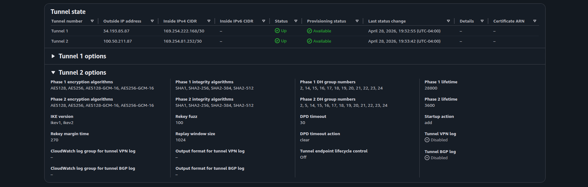
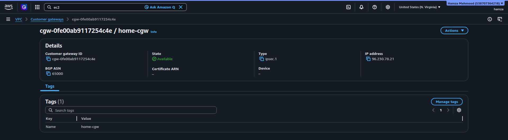
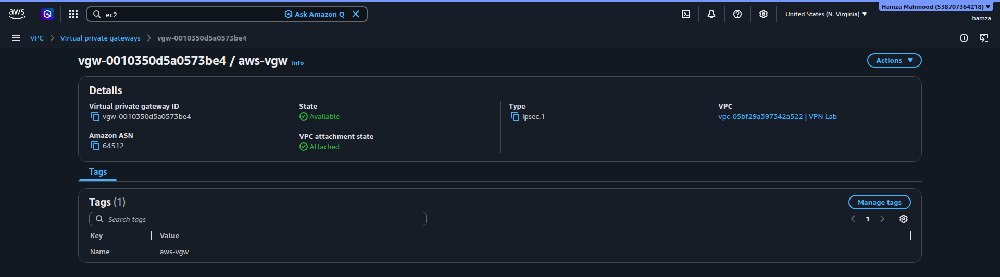

- VPN connection in **Available** state
- Two IPsec tunnels established for redundancy
- Customer Gateway mapped to public NAT endpoint (`96.230.78.21`)
- Virtual Private Gateway attached to VPC as AWS termination point
- Each tunnel uses independent /30 transit networks

---

## Compute Layer

Application workload used for connectivity testing.

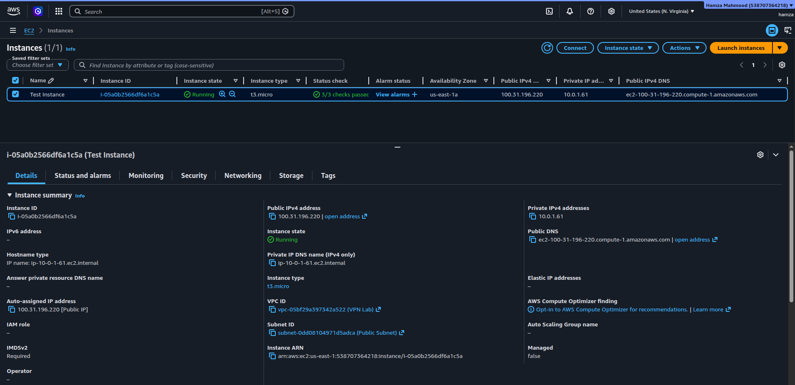
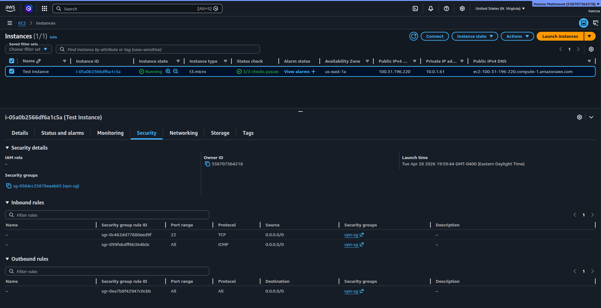

- EC2 instance deployed in private subnet `10.0.1.0/24`
- Static private IP assigned for consistent testing (`10.0.1.61`)
- Security group allows ICMP and SSH for controlled validation

---

## On-Prem Environment

Simulated edge network using GNS3 and Cisco IOSv.

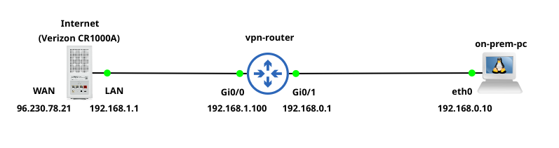

- Internal network: `192.168.0.0/24`
- Edge router acts as Customer Gateway
- WAN interface sits behind NAT (`192.168.1.100 → 96.230.78.21`)
- Represents realistic enterprise edge connectivity model

---

## VPN Data Plane State

Router-level interface, routing, and tunnel verification.

### Interface and Routing State

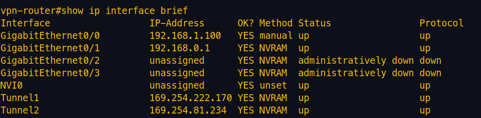
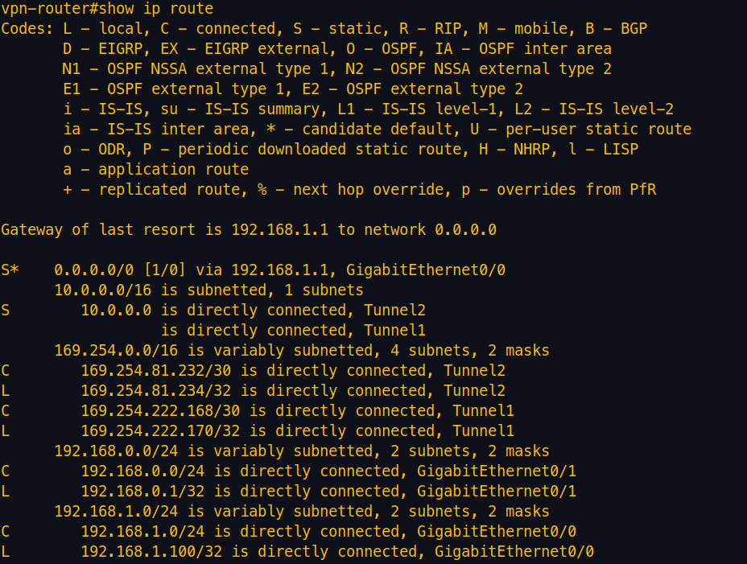

- LAN and WAN interfaces correctly assigned
- Tunnel interfaces operational and up
- AWS-bound traffic routed through VPN tunnels instead of default gateway

---

### IPsec Security Associations

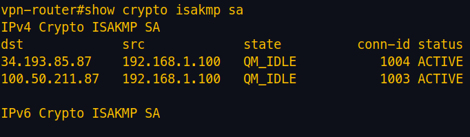
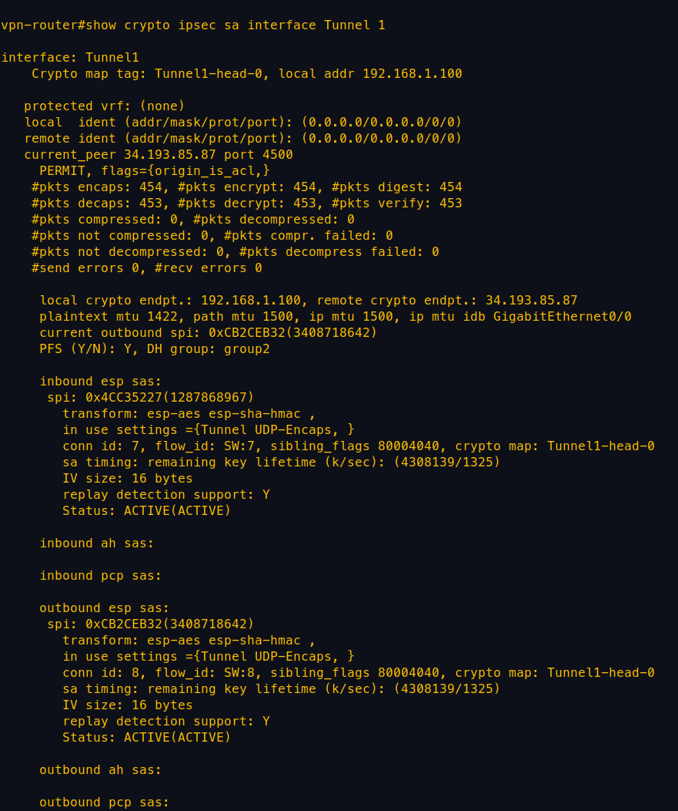
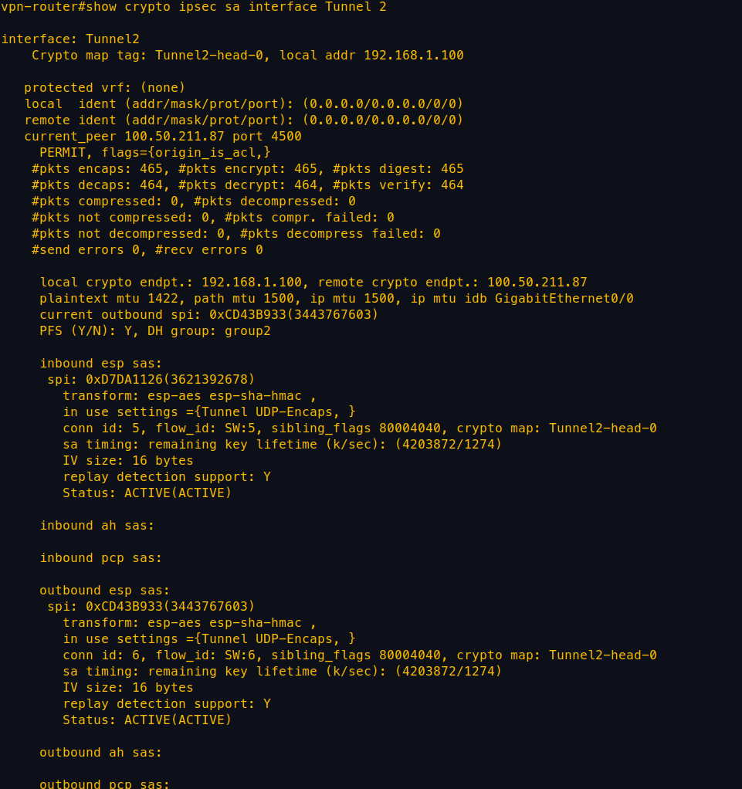

- IKE Phase 1 successfully established (ISAKMP active)
- IPsec Phase 2 operational on both tunnels
- Packet encapsulation confirms encrypted traffic flow
- Dual tunnel state confirms redundancy readiness

---

## End-to-End Connectivity

Validation of bidirectional communication across the hybrid network.

### On-Prem → AWS

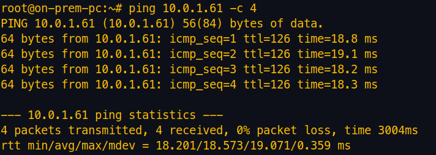
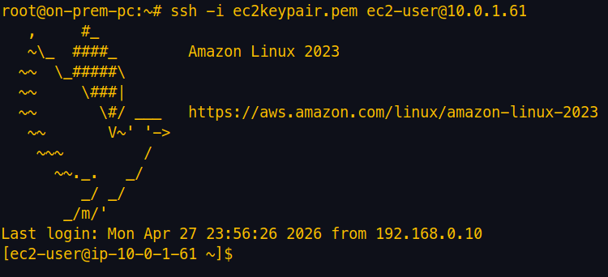

- ICMP and SSH successfully reach AWS private instance
- Traffic traverses NAT → IPsec VPN → VPC route table

---

### AWS → On-Prem

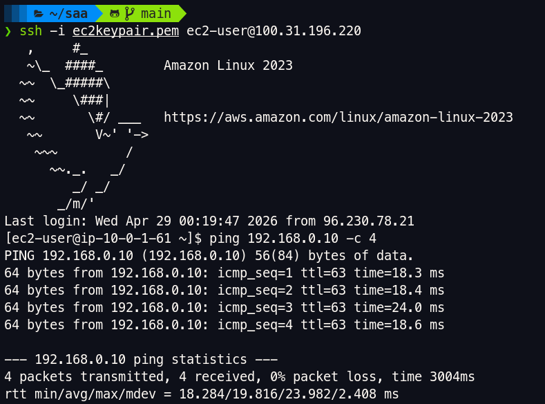
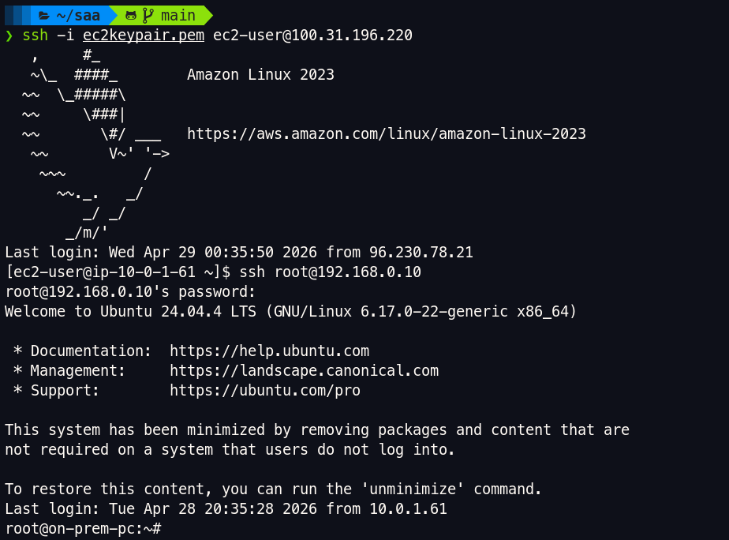

- Reverse connectivity confirmed from AWS to on-prem network
- Validates full bidirectional routing through VPN

---

## Failover Behavior

Resiliency test of dual-tunnel design.

### Primary Tunnel Failure

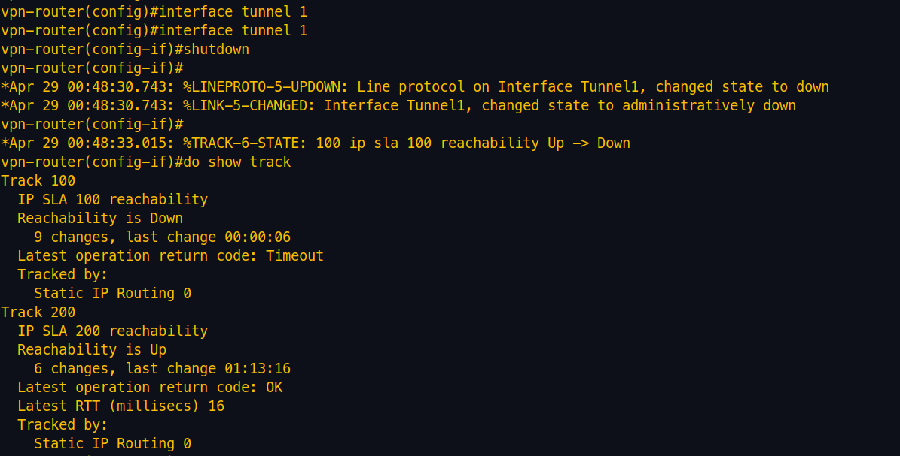

- Primary tunnel intentionally disrupted
- Routing control shifts away from Tunnel 1

---

### Secondary Tunnel Activation

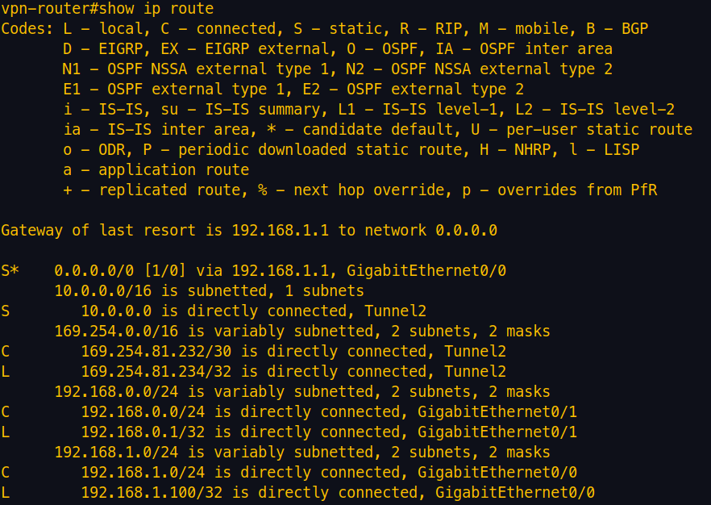

- Tunnel 2 maintains connectivity during failure event
- No interruption in end-to-end traffic flow
- Confirms redundancy mechanism is functional

## What This Project Demonstrates

- AWS Site-to-Site VPN configuration
- Hybrid cloud connectivity (on-prem ↔ AWS)
- VPC routing and private network communication
- NAT-aware VPN deployment in a real-world scenario
- High availability using dual VPN tunnels
- Secure remote access to AWS resources
- End-to-end validation using real traffic

## Supporting Artifacts

This repository includes supporting materials used to validate and document the deployment:

- **[architecture/](./architecture/)**
  - Contains the architecture diagram (PNG + SVG)

- **[configs/](./configs/)**
  - Router configuration (`router-config.txt`)
  - Startup configuration
  - AWS-generated VPN configuration file

- **[screenshots/](./screenshots/)**
  - AWS infrastructure configuration
  - VPN tunnel status
  - Routing and connectivity
  - End-to-end communication
  - Failover behavior